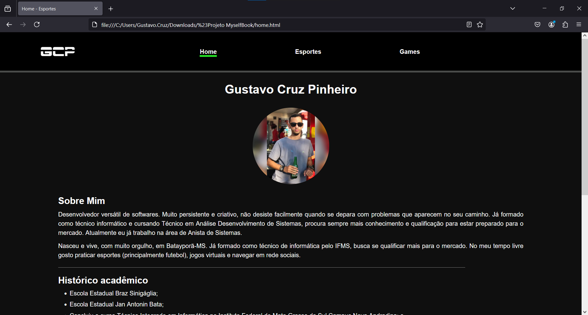
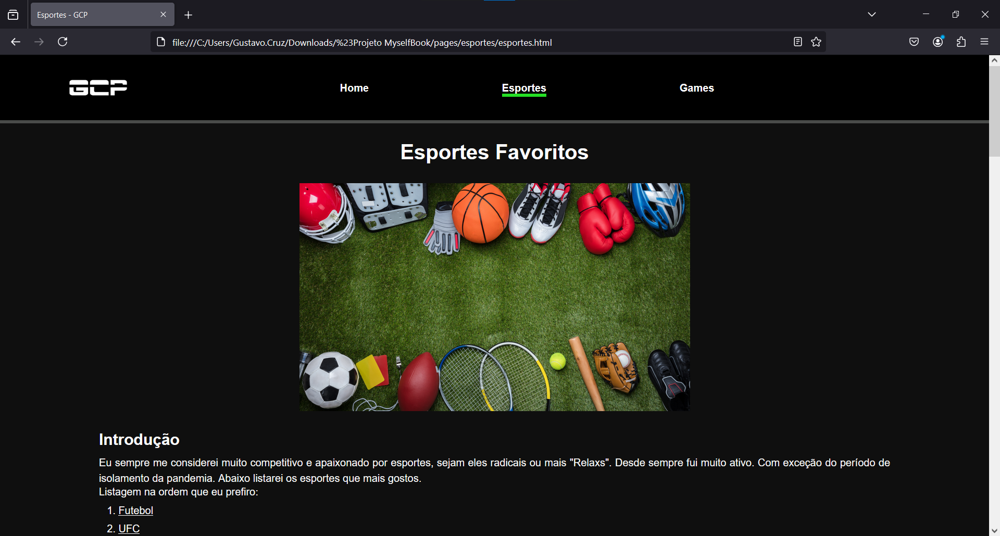
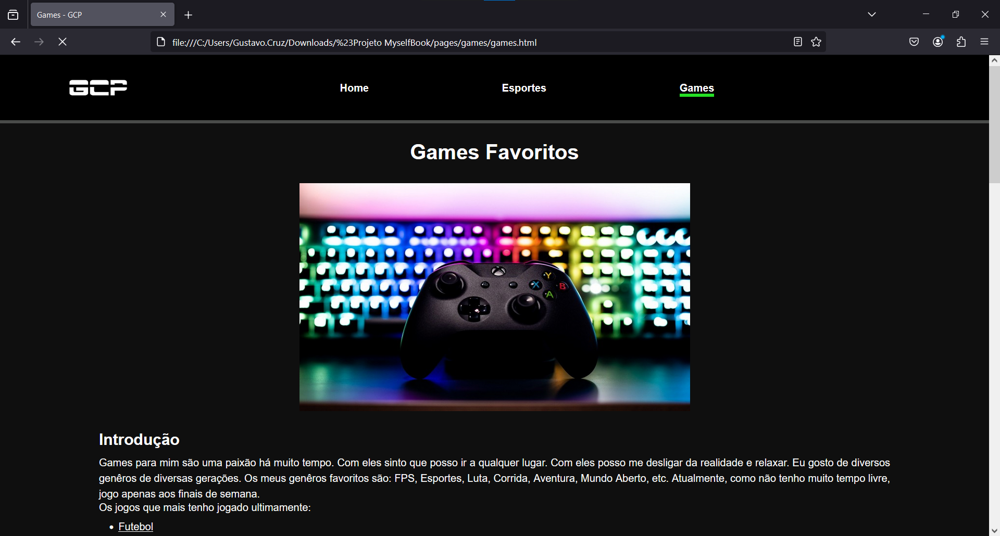

# Book Myself

Projeto desenvolvido como atividade da disciplinas de LAEC nos primeiros semestres do curso TADS para falar um pouco de mim (até o ano de 2021).

## Aplicação
### Tecnologias

Para o desenvolvimento da aplicação foram utilizadas as seguintes tecnologias:

* JavaScript
* HTML
* CSS

## Executando

Para a execução é necessário apenas abrir o arquivo "index.html".
